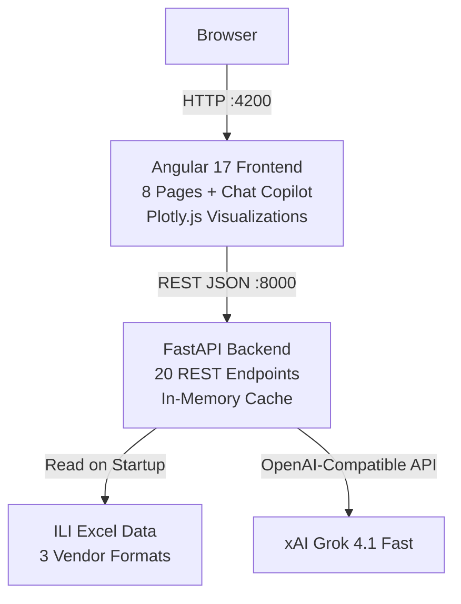
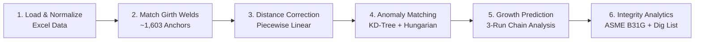
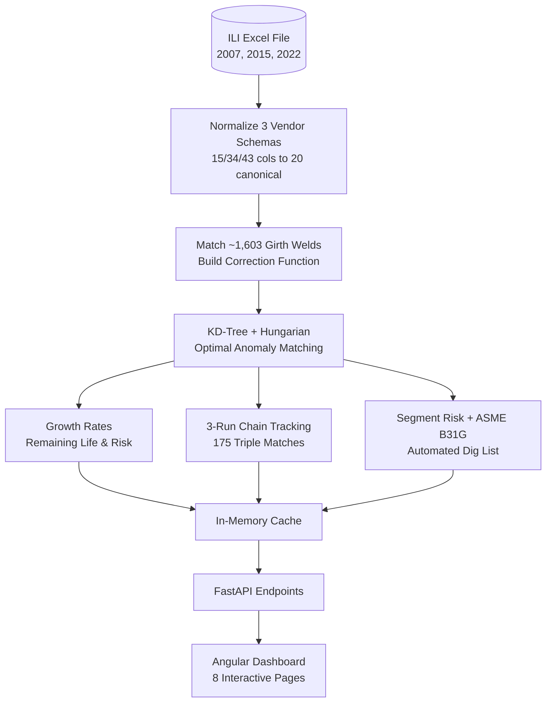
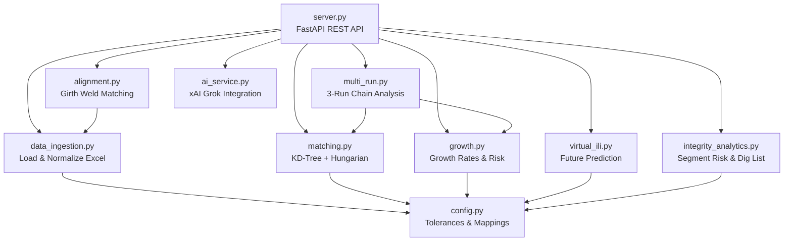
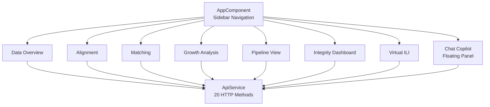

# CorroSight — Pipeline Integrity Intelligence


AI-powered pipeline integrity platform that automates In-Line Inspection (ILI) data alignment, corrosion growth prediction, and repair prioritization across multiple inspection runs. Processes 3 vendor formats (Rosen, Baker Hughes), matches 1,600+ girth welds, and applies globally optimal anomaly matching using KD-trees and the Hungarian algorithm — all served through an interactive Angular dashboard with AI-powered insights via xAI Grok.

<!--  -->

## Table of Contents

- [Features at a Glance](#features-at-a-glance)
- [Architecture](#architecture)
- [Quick Start](#quick-start)
- [The Problem](#the-problem)
- [Key Algorithms](#key-algorithms)
- [AI-Powered Features](#ai-powered-features)
- [Dashboard Pages](#dashboard-pages)
- [Integrity Engineering Dashboard](#integrity-engineering-dashboard)
- [Results Summary](#results-summary)
- [Project Structure](#project-structure)
- [API Reference](#api-reference)
- [Data Quality Handling](#data-quality-handling)
- [Run Pipeline (File Upload)](#run-pipeline-file-upload)
- [Dependencies](#dependencies)
- [Environment Variables](#environment-variables)
- [Roadmap](#roadmap)
- [Contributing](#contributing)
- [License](#license)

## Features at a Glance

- **Multi-Vendor Data Ingestion** — Normalizes 3 ILI vendor formats (Rosen 2007, Baker Hughes 2015/2022) with 15/34/43 columns into a unified 20-column schema
- **Automated Girth Weld Alignment** — Matches ~1,603 reference welds across runs and applies piecewise linear distance correction
- **Globally Optimal Anomaly Matching** — KD-tree candidate search with Hungarian algorithm for provably optimal 1-to-1 assignment
- **Corrosion Growth Prediction** — Linear regression on 3-run history with remaining life estimation and population ensemble statistics
- **ASME B31G Compliance** — Automated defect interaction assessment per industry standards with burst pressure implications
- **Automated Dig List** — Prioritized IMMEDIATE / SCHEDULED / MONITOR repair recommendations with composite urgency scoring
- **AI Chat Copilot** — Natural language Q&A about pipeline data powered by xAI Grok with full analysis context injection
- **Virtual ILI Predictor** — Simulates future inspections (2025–2035) without running the physical tool
- **8 Interactive Dashboard Pages** — Rich Plotly.js visualizations including risk matrices, polar charts, unrolled pipe schematics, and heatmaps
- **One-Click Excel Export** — Full analysis results downloadable as a formatted workbook

## Architecture

### System Overview



### Analysis Pipeline

The backend executes a 6-step analysis pipeline at startup, caching all results in memory for instant API responses:



### Data Flow



## Quick Start

### Prerequisites

| Requirement | Version | Notes |
|---|---|---|
| Python | 3.13+ | With pip |
| Node.js | 18+ | With npm |
| xAI API Key | — | Optional; enables AI features. Without it, the system runs in regex fallback mode |

### Backend

```bash
cd backend
python -m venv venv
source venv/bin/activate          # Windows: venv\Scripts\activate
pip install -r requirements.txt

# (Optional) Enable AI features
echo "XAI_API_KEY=xai-your-key-here" > .env

uvicorn server:app --port 8000
```

### Frontend

```bash
cd frontend
npm install
ng serve --port 4200
```

Open **http://localhost:4200** in your browser.

> **Note:** AI features (chat copilot, Virtual ILI narratives, executive report) require an xAI API key. Without one, the system runs in fallback mode with regex-based chat responses. You can also enter the key at runtime via the chat panel.

## The Problem

Pipeline operators need to compare ILI inspection data collected years apart to track defect evolution. Manual alignment takes weeks and is error-prone. CorroSight automates:

1. **Reference point alignment** — Matching 1,600+ girth welds across runs
2. **Distance correction** — Correcting odometer drift via piecewise linear interpolation
3. **Anomaly matching** — Globally optimal 1-to-1 pairing using the Hungarian algorithm
4. **Growth prediction** — Computing rates and estimating remaining life
5. **Integrity engineering** — ASME B31G interaction assessment, automated dig lists, population analytics
6. **AI intelligence** — Natural language Q&A, Virtual ILI prediction, executive reports

## Key Algorithms

| Stage | Algorithm | Why |
|---|---|---|
| Alignment | Piecewise linear interpolation on 1,603 matched girth welds | Dense anchor points provide accurate local correction |
| Candidate search | KD-tree with trigonometric clock embedding | O(n log m) search handling circular clock positions |
| Matching | Hungarian algorithm (scipy.optimize.linear_sum_assignment) | Globally optimal 1-to-1 assignment |
| Scoring | Weighted multi-attribute similarity (distance, clock, depth, dimensions, type) | Domain-informed weights with asymmetric depth penalty |
| Growth prediction | Linear regression + population ensemble for 3-run trends | 2-3 data points per anomaly; population statistics add robustness |
| Interaction detection | ASME B31G 6×WT axial spacing rule | Industry-standard defect interaction criteria |
| Repair prioritization | Composite urgency score (depth + growth + remaining life) | Directly actionable dig list for operators |

### Multi-Attribute Similarity Scoring

```
Score = 0.35 × distance_proximity + 0.25 × clock_proximity + 0.20 × depth_compatibility
        + 0.10 × dimensional_similarity + 0.10 × type_match
```

Depth scoring is asymmetric: corrosion grows over time, so apparent shrinkage is penalized more heavily than growth.

### Confidence Model

Each match receives a confidence score (0-1) combining:
- Raw similarity (40%)
- Match uniqueness / margin over alternatives (25%)
- Growth rate plausibility (20%)
- Joint number agreement (15%)

## AI-Powered Features

CorroSight integrates xAI's Grok 4.1 Fast model for intelligent pipeline analysis:

| Feature | Description |
|---|---|
| **Chat Copilot** | Floating chat panel for natural language Q&A about pipeline data. Full analysis context (summary stats, top concerns, growth data) injected into system prompt. Fallback mode with regex parsing when no API key. |
| **Virtual ILI Predictor** | Simulates future inspections (2025–2035) by extrapolating growth trends. Two-source rate hierarchy: 3-run linear regression preferred over pairwise rates. Shows predicted risk distributions and top concerns. |
| **AI Executive Report** | One-click generation of a professional integrity assessment report with key findings, risk hotspots, and recommended actions. |
| **AI Anomaly Narratives** | Auto-generated "story cards" for the top 20 highest-risk anomalies, explaining history, current risk, and projected future. |
| **NL Chart Builder** | Type natural language queries ("Show average growth rate by clock position as a polar chart") and the AI generates live Plotly visualizations. |
| **AI Chart Insights** | Toggle AI-generated annotations on any chart highlighting patterns, clusters, and outliers. |

## Dashboard Pages

Eight pages with interactive Plotly.js charts:

1. **Data Overview** — EDA: quality heatmap, event distributions, depth/length/width histograms, clock position polar chart
2. **Alignment** — Girth weld distance scatter, odometer drift plot, joint-level alignment table
3. **Matching** — Confidence distributions, pie chart, filterable/sortable match table with risk badges
4. **Growth Analysis** — Risk matrix scatter, remaining life histogram, top concerns table, multi-run trajectories with 2030 prediction, AI report & narrative cards
5. **Pipeline View** — Unrolled pipe schematic (distance × clock), color by run, match connections, zoom slider, AI segment summary
6. **Integrity Dashboard** — Segment risk heatmap, ASME B31G interaction table, automated dig list with IMMEDIATE/SCHEDULED/MONITOR badges, population growth analytics by quadrant and ID/OD
7. **Virtual ILI Predictor** — Future inspection simulator (2025–2035), predicted risk distribution, top future concerns, AI narrative
8. **Chat Copilot** — Floating AI chat panel (available on all pages), natural language Q&A, suggested questions, summarize button

## Integrity Engineering Dashboard

Domain-specific analytics that go beyond basic matching and growth rates:

### Segment Risk Heatmap
Pipeline divided into 1,000 ft segments with composite risk scores:
```
Risk Score = anomaly_density (25 pts) + max_depth (35 pts) + avg_growth_rate (25 pts) + critical_count (15 pts)
```

### ASME B31G Anomaly Interaction Assessment
Per ASME B31G / RSTRENG standards, anomalies within 6× wall thickness axially can interact, forming a larger effective defect that reduces burst pressure. The system automatically detects interacting clusters and classifies severity (HIGH/MEDIUM/LOW).

### Automated Dig List
Prioritized repair schedule with three categories:
- **IMMEDIATE**: Urgency ≥ 75, or depth ≥ 70%, or remaining life < 3 years
- **SCHEDULED**: Urgency ≥ 50, or depth ≥ 50%, or remaining life < 7 years
- **MONITOR**: Growing anomalies to track

Urgency formula: `depth_component (40%) + growth_rate_component (30%) + remaining_life_component (30%)`

### Population Growth Analytics
Growth rates grouped by clock quadrant (Top/Right/Bottom/Left), corrosion type (Internal/External), and depth band. Reveals systemic patterns:
- Bottom-of-pipe → water settling (internal) or soil-side corrosion (external)
- Top-of-pipe → gas phase corrosion (internal) or coating degradation (external)

## Results Summary

| Metric | 2007 → 2015 | 2015 → 2022 |
|---|---|---|
| Matches found | 307 | 1,016 |
| HIGH confidence | ~33% | ~33% |
| New anomalies | 1,461 | 1,622 |
| Missing anomalies | 404 | 752 |
| Avg growth rate | 0.54 %/yr | 0.81 %/yr |
| Processing time | <1s | <1s |

**175 anomalies** tracked across all 3 runs (2007 → 2015 → 2022) with growth trend prediction.

**Integrity Dashboard results** (2015–2022 pair):
- **155** interacting anomaly clusters detected per ASME B31G
- **12** IMMEDIATE repairs, **40** SCHEDULED, **745** MONITOR
- **11** high-risk pipeline segments (score ≥ 60/100)
- Highest risk: Segment 45 (44,000–45,000 ft) — score 87.0, 184 anomalies, 79% max depth

## Project Structure

### Backend Modules



```
backend/
  server.py              — FastAPI REST API (20 endpoints)
  config.py              — Tolerances, column maps, event maps, weights
  data_ingestion.py      — Load Excel, normalize 3 vendor formats, validate
  alignment.py           — Girth weld matching, piecewise distance correction
  matching.py            — KD-tree search, similarity scoring, Hungarian matching
  growth.py              — Growth rates, remaining life, risk scoring, prediction
  multi_run.py           — 3-run chain matching, lifecycle tracking, Excel export
  ai_service.py          — xAI Grok integration, prompt building, fallback chat
  virtual_ili.py         — Future inspection prediction engine
  integrity_analytics.py — Segment risk, ASME B31G interaction, dig list, population analytics
```

### Frontend Architecture



```
frontend/                — Angular 17 standalone components
  src/app/pages/
    data-overview/       — EDA visualizations
    alignment/           — Girth weld alignment charts
    matching/            — Match results and confidence analysis
    growth/              — Growth analysis, AI report, narrative cards
    pipeline-view/       — Unrolled pipe schematic with AI summary
    virtual-ili/         — Virtual ILI future predictor
    integrity-dashboard/ — Segment risk, ASME B31G, dig list, population analytics
  src/app/components/
    chat-copilot/        — Floating AI chat panel
    metric-card/         — Reusable metric display card
  src/app/services/
    api.service.ts       — HTTP client (20 API methods)
```

## API Reference

### Core Data

| Method | Endpoint | Description |
|---|---|---|
| GET | `/api/summary` | Run metadata and anomaly/girth weld counts |
| GET | `/api/quality` | Data quality report and column completeness |
| GET | `/api/eda` | Event distributions, depth/length/width/clock data |
| GET | `/api/alignment` | Girth weld alignment table and drift stats |
| GET | `/api/matches/{pair}` | Match results for a run pair (e.g., `2015-2022`) |
| GET | `/api/growth/{pair}` | Growth rates, risk scores, top concerns |

### Multi-Run & Export

| Method | Endpoint | Description |
|---|---|---|
| GET | `/api/multirun` | Triple-match data, lifecycle summary, trajectories |
| GET | `/api/pipeline-view` | Anomaly positions and match connections |
| GET | `/api/export` | Download Excel with all analysis results |

### AI Features

| Method | Endpoint | Description |
|---|---|---|
| POST | `/api/chat` | AI copilot chat (message + history) |
| GET | `/api/ai-report` | AI executive summary report |
| GET | `/api/ai-narratives` | AI narrative cards for top concerns |
| POST | `/api/ai-insights` | AI chart annotations |
| POST | `/api/nl-chart` | Natural language chart builder |
| GET | `/api/virtual-ili/{year}` | Virtual ILI prediction for target year |

### Integrity Analytics

| Method | Endpoint | Description |
|---|---|---|
| GET | `/api/integrity-dashboard` | Segment risk, interactions, dig list, population |

### Configuration & Upload

| Method | Endpoint | Description |
|---|---|---|
| POST | `/api/set-api-key` | Set xAI API key at runtime |
| GET | `/api/ai-status` | AI service configuration status |
| POST | `/api/run-pipeline` | Upload Excel file and run full analysis |
| GET | `/api/run-pipeline/status` | Pipeline run progress |

## Data Quality Handling

- **3 different vendor schemas** — Config-driven column mapping (15/34/43 columns normalized to 20 canonical names)
- **Inconsistent event naming** — Normalization map (59+ raw types → 28 canonical types)
- **Clock position formats** — Unified conversion to decimal hours (0–12)
- **Missing values** — KNN imputation for dimensions; graceful degradation in scoring
- **Cluster decomposition** — 2007 clusters matched to individual 2022 metal loss features
- **Outlier detection** — IQR-based flagging + domain thresholds (>5%/yr growth)

## Run Pipeline (File Upload)

Click **Run Pipeline** in the sidebar to upload a new Excel file. The system processes the file through all 6 analysis steps with real-time progress tracking (step counter, progress bar, live stats). Results update across all pages upon completion.

## Dependencies

### Backend (Python)

| Package | Version | Purpose |
|---|---|---|
| pandas | >= 2.0 | Data manipulation and analysis |
| numpy | >= 1.24 | Numerical computation |
| scipy | >= 1.11 | KD-tree, Hungarian algorithm, interpolation |
| scikit-learn | >= 1.3 | KNN imputation, statistical utilities |
| fastapi | >= 0.104 | REST API framework |
| uvicorn | >= 0.24 | ASGI server |
| openpyxl | >= 3.1 | Excel file reading |
| xlsxwriter | >= 3.1 | Excel file writing (export) |
| openai | >= 1.0 | xAI Grok API client (OpenAI-compatible) |
| python-multipart | >= 0.0.6 | File upload handling |

### Frontend (Node.js)

| Package | Version | Purpose |
|---|---|---|
| @angular/core | ^17.3.0 | UI framework |
| @angular/material | ^17.3.10 | Material Design components |
| angular-plotly.js | ^20.0.0 | Plotly.js Angular wrapper |
| plotly.js-dist-min | ^3.3.1 | Interactive charting library |
| rxjs | ~7.8.0 | Reactive programming |
| typescript | ~5.4.2 | Type-safe JavaScript |

## Environment Variables

| Variable | Required | Default | Description |
|---|---|---|---|
| `XAI_API_KEY` | No | None | xAI API key for Grok LLM features. Set in `backend/.env` or as an environment variable. Can also be set at runtime via the chat panel. |

## Roadmap

- [ ] Docker containerization (backend + frontend)
- [ ] CI/CD pipeline with GitHub Actions
- [ ] Unit and integration test suites
- [ ] Database persistence (PostgreSQL / SQLite)
- [ ] Multi-pipeline support (analyze multiple pipeline segments)
- [ ] PDF report export
- [ ] Role-based access control
- [ ] Deployment documentation (cloud providers)

## Contributing

Contributions are welcome! Here's how you can help:

1. Fork the repository
2. Create a feature branch (`git checkout -b feature/amazing-feature`)
3. Commit your changes (`git commit -m 'Add amazing feature'`)
4. Push to the branch (`git push origin feature/amazing-feature`)
5. Open a Pull Request

## License

This project is licensed under the MIT License. See the [LICENSE](LICENSE) file for details.
